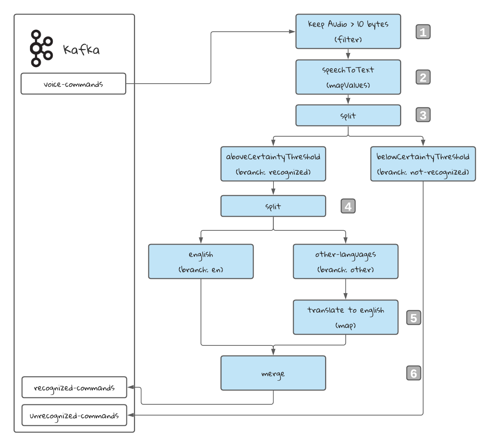

# Voice Command Parser: Stateless Processing in Kafka Streams
## Introduction
In this app, what we want to accomplish is the following:
 * Understand the concept of **stateless** operations
 * Work with the class `KStream`
 * Get to know a bit better the `Serdes` interface and how we have to use it

## Stateless Processing
Stateless processing is a type of processing that doesn't have any memory, or doesn't store any state, and therefore the only context of the process is the input data and the algoritm that will process it.
You can think of the stateless operations as a `function` without any side effects in the functional programming paradigm. An example of stateless processing in Java would be the following:
```java
List.of("Car", "Truck", "Motorbike")
    .forEach(item -> System.out.println(item))
```
The program will print every vehicle independent of the other, without keeping any memory of the previous events.

## Advantages of Stateless Processing
* Given the simplicity of the operations, they are easier to understand
* All the events are independent of the other events
* Easier to scale, because there is no data store involved
* Because each event is independent, the processing is threadsafe

Anyway, most applications can manage to be purely stateless, that's why we will introduce the concept of [Stateful Processing]() in the following tutorials.

## KStream
The High-level DSL brings a powerful abstraction to deal with Stateless processing. It's called `KStream`. It represents a stream of events independent of each other.

## Stateless Operations
Kafka Streams supports the following stateless operations applicable to a `KStream`:
* Filtering (The `filter` operation)
* Adding and removing fields (`map` operation)
* Selecting a new Key for the stream (`selectKey` operation)
* Branching Streams (`split/branch` operation)
* Merging Streams (`merge` operation)
* Transforming records into one or multiple records (`map/flatMap` operations)
* Enriching records (`map` operation)

The only way to keep your application stateless is if you limit yourself to these operations. If you were to add at least one stateful operation, then your application will be considered stateful.

## Our Application
The tutorial is an application that will receive Voice Commands and will convert them into text commands, if it's able to recognize them, and will put the unrecognized commands in a different topic.

The audio will be in FLAC format and is prepared to be used by the Speech To Text API in Google Cloud Platform. For the purpose of testing, we are going to be using a mock service.

The commands that are not in English will be translated to English to be further processed by a third hypothetical service. The translation service will also be mocked for testing purposes.
## Application Diagram


## Requirements
* Docker: We will use it to start Kafka and create the topics
* Java 15
* An IDE like Intellij IDEA

## Running the project

### Starting Kafka
First, we need to start Kafka. For that we have a [docker-compose.yml file](docker-compose.yml) that will create the necessary resources for us. It will start a Zookeeper instance and a Kafka broker. It will also create the necessary topics using the script found in the [create-topics.sh](./scripts/create-topics.sh) file.
```shell
docker compose -f ./docker-compose.yml up
```
### Building and starting the application
```shell
./mvnw compile exec:java -Dexec.mainClass="com.github.programmingwithmati.kafka.streams.wordcount.VoiceCommandParserApp"
```
### Continuar 

## Data Model

### Voice Command
We created all our model classes in the [model package](src/main/java/com/github/programmingwithmati/voice/model).

The input is a `JSON` object that we call `VoiceCommand`. It has the following format:

```json
{
  "id": "e0b80c6a-5c59-479c-b8d4-0b3f375e8b19",
  "audio": "ZkxhQwAAACISABIAAAS1AAmZC7gA8AABT8CXxiNQ3flBeL6CF4DLzQ==", 
  "audioCodec": "FLAC",
  "language": "en-US"
}
```
The `audio` field is a Base64 encoded byte which can be parsed in Java as a `byte[]`.

The output is a different `JSON` object that we call `ParsedVoiceCommand`. The format is the following:
```json
{
  "id": "e0b80c6a-5c59-479c-b8d4-0b3f375e8b19",
  "text": "call john", 
  "audioCodec": "FLAC",
  "language": "en-US",
  "probability": 0.9741235
}
```
The `text` field is what we got from the **Speech to Text Service**. The `probability` field indicates the certainty that the text we've got actually corresponds to the audio file. In our program we will define a Threshold to accept commands

## Understanding the Topology

1️⃣ **filter** Keep only audio files that have at least 11 bytes. This is to avoid unnecessary processing of files that will probably not contain commands.

2️⃣ **mapValues** Call the **Speech To Text Service** to transform the audio file into text.

3️⃣ **split**: Create two branches. One for the commands above the certainty threshold, and those bellow it.

4️⃣ **split**: Create two more branches. One for the English commands and one for the rest of the commands.

5️⃣ **mapValues**: Translate to English the commands that are in other language.

6️⃣ **merge**: Merge both streams before sending the data to the topic `recognized-commands`.

## Unit Testing Our Topology
To modularize the application, the Topology is created in a separated class. This allows us to test the Topology that we created with Unit tests. Kafka Streams provides a library called `kafka-streams-test-utils`
